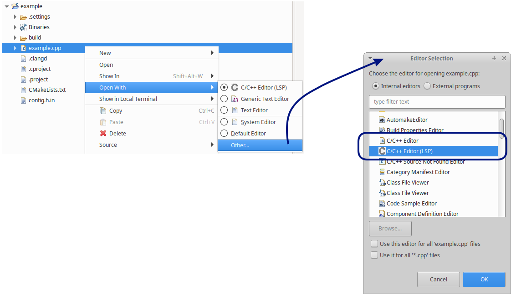

# Eclipse CDT LSP - LSP based C/C++ Editor

**Target audience** are Eclipse plugin developers who want to use/develop a LSP based C/C++ Editor.

This plugin is based on the [LSP4E](https://github.com/eclipse/lsp4e) and [TM4E](https://github.com/eclipse/tm4e) Eclipse projects. The editor is based on the `ExtensionBasedTextEditor` in Eclipse.

The `org.eclipse.cdt.lsp` is the core plugin. C/C++ IDE Developers can use the `serverProvider` extension point to define a C/C++ language server. If there is no extension defined, the LLVM [clangd](https://clangd.llvm.org/) language server will be used and searched on the PATH environment variable. Clangd searches for a `compile_commands.json` file in the source file folder and its parents. It's needed to determine the compile informations. In the default clangd configuration the PATH will be searched for a `gcc` compiler to determine the default compiler include paths.

The editor is basically the `ExtensionBasedTextEditor`. The language grammar comes from [TM4E](https://github.com/eclipse/tm4e). 

The Editors features depends on the support on client ([LSP4E](https://github.com/eclipse/lsp4e)) and server ([clangd](https://clangd.llvm.org/)) side.
Currently these feature are supported (clangd 15.0.3) and current LSP4E:

- Auto completion
- Hovering
- Formatting
- Go to Declaration
- Find References
- Code actions (Declare implicit copy/move members, Extract to function/variable, rename)
- Quick Fix (Ctrl+1)
- Type hierarchy (quick hierarchy view only) 
- Call hierarchy
- Outline view

Not supported (yet):
- Include browser (Eclipse CDT speciality)

The `org.eclipse.cdt.lsp` plugin provides an activation for the LSP based C/C++ Editor on project and workspace level. 
The language server path and the arguments can be changed in the workspace preferences as well:

Newly created C/C++ projects will inherit the *Prefer C/C++ Editor (LSP)* setting from the workspace preferences. This can be changed in the project properties:

Different C/C++ projects using the old and new editor as default can be mixed in one workspace. The linked include files will be opened with the same editor.

To use these plugins import them in your CDT sources.

**TODO:**
see [issues](https://github.com/eclipse-cdt/cdt-lsp/issues)

## Setup the source

To try out the plug-ins in their current state you need to run them from source.

1. Setup a CDT development environment following the instructions in [CDT's contributing instructions](https://github.com/eclipse-cdt/cdt/blob/main/CONTRIBUTING.md#contributing-to-cdt).
2. Clone this repo
3. Import the plug-ins in this repo into Eclipse development environment from Step 1
4. Launch the Eclipse IDE with this Pug-ins tab settings from the launch config: *All workspace and enabled target Pug-ins* from your development IDE

## Install pre-requisites

The following tools are needed on the `PATH` to operate the demo.

- gcc, make and other standard build tools
- cmake 3.10 or more recent - See [cmake installation instructions](https://cmake.org/install/)
- clangd 15.0.3 or more recent - See [clangd installation instructions](https://clangd.llvm.org/installation#installing-clangd)

## Try it out

You can import an existing project that contains a `compile_commands.json` file, or follow these instructions to create a simple starting project.

### Create an example CMake project

1. *File* -> *New* -> *Project...*
2. Choose *C/C++* -> *C/C++ Project* and press *Next*
3. Choose *CMake Project* and press *Next*
4. Enter a name for the project, e.g. `example` (avoid special characters and dashes, see https://github.com/eclipse-cdt/cdt/issues/288)
5. Press *Finish*
6. Build the project to create the Compilation Database (`compile_commands.json` file)

The root of the project contains a `.clangd` file which tells clangd where clangd should fine the compilation database.
This file may be hidden by default, therefore to see the file uncheck the *.\* resources* in the filters for the *Project Explorer* view

### Open a file

By default C/C++ will be opened with the standard CEditor.
The default can be changed per project or per workspace with the *C/C++ General* -> *Editor (LSP)* -> *Prefer C/C++ Editor (LSP)* checkbox in the project setting or preferences.

- Note: The workspace setting will be used for new projects only. To use the LSP based editor on a project, *Prefer C/C++ Editor (LSP)* must be activated in the project properties.

Alternatively, you can choose which editor to open the file by using *Open With*:

With the *C/C++ Editor (LSP)* open, the presentation of the C++ file will follow the LSP4E conventions augmented by the information returned from clangd.

### Known issues

See the open issues for [known issues](https://github.com/eclipse-cdt/cdt-lsp/issues) and workarounds while the code is in active development.
