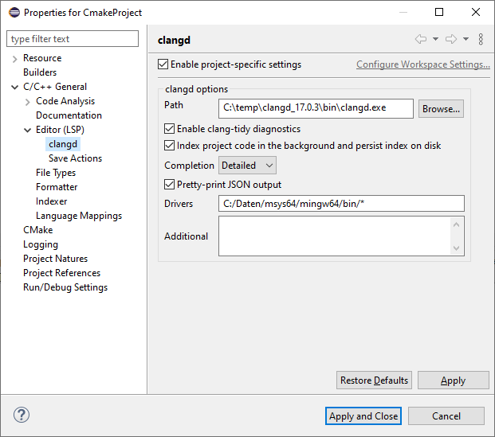

# Eclipse CDT LSP - LSP based C/C++ Editor

**Target audience** CDT users who want to use a language server based C/C++ Editor which supports newer C/C++ standards and Eclipse plugin developers who want to use/develop a LSP based C/C++ Editor. The editor in this Eclipse feature is backed by the [LLVM clangd C/C++ language server](https://clangd.llvm.org/).

This plugin is based on the [LSP4E](https://github.com/eclipse/lsp4e) and [TM4E](https://github.com/eclipse/tm4e) Eclipse projects. The editor is based on the [`ExtensionBasedTextEditor`](https://github.com/eclipse-platform/eclipse.platform.ui/blob/master/bundles/org.eclipse.ui.genericeditor/src/org/eclipse/ui/internal/genericeditor/ExtensionBasedTextEditor.java#L55-L56) in Eclipse.

The [`org.eclipse.cdt.lsp`](https://github.com/eclipse-cdt/cdt-lsp/tree/master/bundles/org.eclipse.cdt.lsp) is the core plugin. C/C++ IDE Developers can use the [`serverProvider`](https://github.com/eclipse-cdt/cdt-lsp/blob/master/bundles/org.eclipse.cdt.lsp/schema/serverProvider.exsd) extension point to define a C/C++ language server. If there is no extension defined, the LLVM [clangd](https://clangd.llvm.org/) language server will be used and searched on the PATH environment variable. Clangd searches for a `compile_commands.json` file in the source file folder and its parents. It's needed to determine the compile informations. In the default clangd configuration, the PATH will be searched for a `gcc` compiler to determine the default compiler include paths.

The editor is basically the `ExtensionBasedTextEditor`. The language grammar comes from [TM4E](https://github.com/eclipse/tm4e). 


<!-- 

For regenerating the overall screenshot create a new CMake project in Eclipse called
something similar to HelloCMake and use this contents for the main file to allow
showing the following features:

- Project Explorer expanded to show outline
- Outline View
- hover over something from the std library
- Open type hierarchy for Message
- Open call hierarchy for display

#include <iostream>
using namespace std;

class Message {
public:
  virtual void display() = 0;
};

class HelloWorld : Message {
public:
  void display() { cout << "Hello World" << endl; }
};

class CDTDoesLsp : Message {
public:
  void display() { cout << "CDT does LSP" << endl; }
};

int main() {
  HelloWorld hw;
  hw.display();
  CDTDoesLsp cdt;
  cdt.display();

  return 0;
}

-->

The Editors features depends on the support on client ([LSP4E](https://github.com/eclipse/lsp4e)) and server ([clangd](https://clangd.llvm.org/)) side.
Currently these feature are supported (clangd 17) and current LSP4E:

- Auto completion
- Hovering
- Formatting
- Go to Declaration
- Find References
- Code actions (Declare implicit copy/move members, Extract to function/variable, rename)
- Quick Fix (Ctrl+1)
- Type hierarchy
- Call hierarchy
- Outline view

Not supported (yet):
- Include browser (Eclipse CDT speciality)

### Activating LSP based C/C++ Editor

The `org.eclipse.cdt.lsp` plugin provides an activation UI for the LSP based C/C++ Editor on project and workspace level.


 
The clangd path and the arguments can be changed in the workspace preferences as well:


Newly created C/C++ projects will use the settings from the workspace preferences. This can be changed in the project properties:



Different C/C++ projects using the old and new C/C++ editor can be mixed in one workspace. The linked include files will be opened with the same editor.

To use these plugins import them in your CDT sources.

**TODO:**
see [issues](https://github.com/eclipse-cdt/cdt-lsp/issues)

## Try it out

1. Download the latest Developer Build of Eclipse for C/C++ Developers or Eclipse for Embedded C/C++ Developers using the [Eclipse installer](https://www.eclipse.org/downloads/packages/installer) or downloading and extracting the latest release available on [eclipse.org](https://www.eclipse.org/downloads/packages/release/).
2. Add to your Available Software Sites and install *C/C++ LSP Support* in the *Eclipse CDT LSP* Category and restart Eclipse from one of these p2 sites:
    - For latest release: `https://download.eclipse.org/tools/cdt/releases/cdt-lsp-latest`
    - For current master branch continuous build: `https://download.eclipse.org/tools/cdt/builds/cdt-lsp/master/`
3. [Install Pre-requisites](#install-pre-requisites) listed below
4. [Create a CMake project](#create-an-example-cmake-project) or [import an existing](#import-an-existing-project) project following guidelines below
5. [Enable the LSP based C/C++ Editor](#activating-lsp-based-cc-editor) following instructions above.

See [contribution guide](CONTRIBUTING.md) for details on running CDT LSP from source.

### Install pre-requisites

The following tools are needed on the `PATH` to operate the demo.

- gcc, make and other standard build tools
- cmake 3.10 or more recent - See [cmake installation instructions](https://cmake.org/install/)
- clangd 15.0.3 or more recent - See [clangd installation instructions](https://clangd.llvm.org/installation#installing-clangd)

### Import an existing project

You can import an existing project that contains a `compile_commands.json` file, or follow these instructions to create a simple starting project. 
The language server (clangd) searches for a `compile_commands.json` file in the source file folder and its parents. Users can define a `.clangd` file in the project root to configure clangd (e.g. add include paths).
A [.clangd](https://clangd.llvm.org/config#files) is a text file with YAML syntax. A `compile_commands.json` file can be generated by CMake.

[!TIP] 
This configuration entry in the `.clangd` file would tell clangd to use the `compile_commands.json` file in the build/default folder:

```yaml
CompileFlags:
  CompilationDatabase: build/default
```

### Create an example CMake project


1. *File* -> *New* -> *Project...*
2. Choose *C/C++* -> *C/C++ Project* and press *Next*
3. Choose *CMake Project* and press *Next*
4. Enter a name for the project, e.g. `example` (avoid special characters and dashes, see https://github.com/eclipse-cdt/cdt/issues/288)
5. Press *Finish*
6. Build the project to create the Compilation Database (`compile_commands.json` file)

The root of the project contains a `.clangd` file which tells clangd where clangd should fine the compilation database.
This file may be hidden by default, therefore to see the file uncheck the *.\* resources* in the filters for the *Project Explorer* view

### Open a file

By default C/C++ will be opened with the standard CEditor.
The default can be changed per project or per workspace with the *C/C++ General* -> *Editor (LSP)* -> *Set C/C++ Editor (LSP) as default* checkbox in the project properties or workspace preference page.

[!TIP]
The workspace setting will be used for projects that have not checked the *Enable project specific settings* checkbox in the project properties -> *C/C++ General* -> *Editor (LSP)* page.

[!NOTE]
Opening a C/C++ file using *Open With* in the context menu of a file won't work for the LSP based editor, because the language server won't be started if *Set C/C++ Editor (LSP) as default* is not enabled!

With the *C/C++ Editor (LSP)* open, the presentation of the C++ file will follow the LSP4E conventions augmented by the information returned from clangd.


### Version Support

The following table shows the versions of the main dependencies of CDT LSP for best operation as developed and tested.
For example, CDT LSP 1.0.x was developed against clangd 15.0.x but CDT LSP should work with newer versions of clangd as well.
For plug-in dependencies the MANIFEST.MF's dependency information will provide the most accurate information.

| CDT LSP Version | clangd | cmake* | Eclipse IDE Release |
|:-:|:-:|:-:|:-:|
| 1.0.x | 15.0.x | 3.x | 2023-09 |
| 1.1.x | 17.0.x | 3.x | 2023-12 |

\* cmake is required to run through the demo flow, but any tool that can create compile_commands.json or otherwise feed settings to clangd is suitable.

### Known issues

See the open issues for [known issues](https://github.com/eclipse-cdt/cdt-lsp/issues) and workarounds while the code is in active development.
